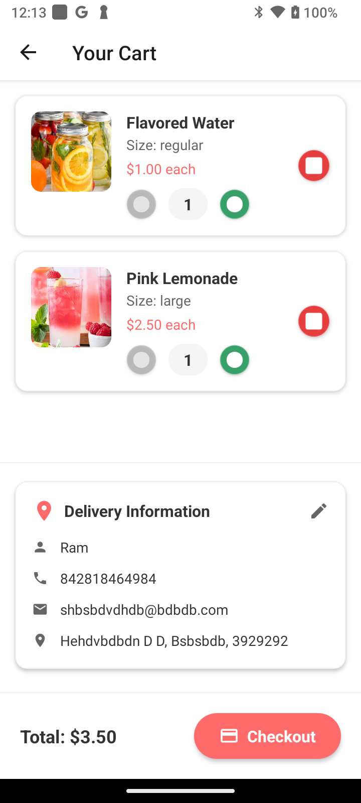

# 🥤 Chill N Drink

[](https://reactnative.dev/)
[](https://reactnative.dev/)
[](#license)

[](https://github.com/spkdroid/Lemonade/actions/workflows/ci-cd.yml)
[](https://github.com/spkdroid/Lemonade/actions)

## 📥 Download Latest Build

| Build Type | Status | Download |
|------------|--------|----------|
| 🛠**Debug APK** | [](https://github.com/spkdroid/Lemonade/actions/workflows/ci-cd.yml) | [📱 Download Debug APK](https://github.com/spkdroid/Lemonade/actions/workflows/ci-cd.yml) |
| 🚀 **Release APK** | [](https://github.com/spkdroid/Lemonade/actions/workflows/ci-cd.yml) | [📱 Download Release APK](https://github.com/spkdroid/Lemonade/actions/workflows/ci-cd.yml) |

> **Note**: Click on the download links above, then click on the latest successful workflow run, and download the APK from the "Artifacts" section.

## 🎬 App Demo

<div align="center">

### 📱 See Chill N Drink in Action

https://github.com/spkdroid/Lemonade/raw/master/screenshots/Demo.mp4

*Experience the smooth, intuitive interface of our beverage ordering app*

</div>

A modern, professional beverage ordering mobile application built with React Native. Chill N Drink offers a seamless experience for browsing and ordering refreshing drinks with a beautiful, intuitive interface inspired by leading food delivery platforms.

## 📱 About Chill N Drink

**Chill N Drink** is a premium beverage ordering platform that brings the best drinks directly to your doorstep. Our app features a curated selection of:

- 🍋 **Fresh Lemonades** - Classic and flavored varieties
- 🥤 **Smoothies** - Nutritious fruit and vegetable blends  
- 🧊 **Iced Teas** - Refreshing herbal and traditional teas
- ☕ **Hot Beverages** - Specialty coffee and warm drinks
- 🍿 **Snacks** - Perfect pairings for your drinks

### Key Features

- **Modern UI/UX** - Professional design inspired by DoorDash and Uber Eats
- **Real-time Menu** - Dynamic menu loading with categories and search
- **Smart Cart** - Persistent cart with quantity management
- **Secure Checkout** - Integrated payment processing and order validation
- **Portrait Optimized** - Locked orientation for optimal mobile experience
- **Offline Support** - Cached menu data for seamless browsing

## 🏗️ Architecture

Chill N Drink follows **Clean Architecture** principles with a clear separation of concerns:

```
src/
├── 📱 presentation/          # UI Layer
│   ├── screens/             # Screen components
│   ├── components/          # Reusable UI components
│   ├── viewModels/         # MVVM presentation logic
│   └── navigation/         # App navigation setup
├── 🏢 domain/              # Business Logic Layer
│   ├── models/             # Data models
│   ├── usecases/          # Business use cases
│   └── repositories/      # Repository interfaces
├── 🗄️ data/               # Data Layer
│   ├── repositories/      # Repository implementations
│   └── datasources/       # API and local data sources
├── 🔧 infrastructure/     # Infrastructure Layer
│   └── storage/           # Local storage services
└── 🛠️ utils/             # Shared utilities
```

### Design Patterns Used

- **MVVM (Model-View-ViewModel)** - Clean separation of UI and business logic
- **Repository Pattern** - Abstracted data access layer
- **Use Case Pattern** - Encapsulated business operations
- **Dependency Injection** - Loose coupling and testability

## 🌐 Backend Services

Chill N Drink integrates with robust backend services to provide real-time functionality:

### Menu Service
- **Endpoint**: `https://www.spkdroid.com/orange/menu.php`
- **Features**: Dynamic menu loading, category management, item details
- **Caching**: Local storage with automatic refresh

### Checkout Service  
- **Endpoint**: `https://www.spkdroid.com/orange/checkout.php`
- **Features**: Order processing, payment validation, order confirmation
- **Security**: Encrypted payment data, secure order transmission

### API Features
- RESTful architecture
- JSON response format
- Error handling and validation
- Rate limiting and security

## 📸 Screenshots

Here are a few screenshots showcasing key features of the app:

| Home Screen | Menu List | Add to Cart |
|-------------|-------------|--------------|
|  |  |  |

| Add to Cart | Checkout | Order Confirmation |
|-------------|-------------|--------------|
|  |  |  |

| Checkout Success |
|-------------|
|  |

## 🚀 Getting Started

### Prerequisites

Before running Chill N Drink, ensure you have completed the [React Native Environment Setup](https://reactnative.dev/docs/set-up-your-environment).

**Required Tools:**
- Node.js (16.0 or higher)
- React Native CLI
- Android Studio (for Android development)
- Xcode (for iOS development, macOS only)

### Installation

1. **Clone the repository**
   ```bash
   git clone https://github.com/spkdroid/Lemonade
   cd Lemonade
   ```

2. **Install dependencies**
   ```bash
   npm install
   ```

3. **iOS Setup** (macOS only)
   ```bash
   bundle install
   bundle exec pod install --project-directory=ios
   ```

4. **Start Metro bundler**
   ```bash
   npm start
   ```

5. **Run the app**
   ```bash
   # Android
   npm run android
   
   # iOS
   npm run ios
   ```

## 🔨 Build Scripts

Chill N Drink includes comprehensive build automation:

### Production Builds

```bash
# Android Release APK
./build.sh android release

# iOS Release Archive
./build.sh ios release

# Both platforms
./build.sh both release
```

### Development Builds

```bash
# Quick Android debug
./dev.sh android

# Quick iOS debug  
./dev.sh ios

# Start Metro only
./dev.sh metro
```

### Build Outputs

- **Android Debug**: `android/app/build/outputs/apk/debug/app-debug.apk`
- **Android Release**: `android/app/build/outputs/apk/release/app-release.apk`
- **iOS Archive**: `ios/build/ChillNDrinkApp.xcarchive`

## 🛠️ Development

### Code Style

This project uses ESLint and Prettier for consistent code formatting:

```bash
# Lint code
npm run lint

# Format code
npm run format
```

### Testing

```bash
# Run tests
npm test

# Run tests with coverage
npm run test:coverage
```

## 🤝 Contributing

We welcome contributions to Chill N Drink! Please read our contributing guidelines before submitting pull requests.

1. Fork the repository
2. Create a feature branch
3. Make your changes
4. Add tests if applicable
5. Submit a pull request

## 🐛 Troubleshooting

### Common Issues

**Metro bundler not starting:**
```bash
npx react-native start --reset-cache
```

**Android build errors:**
```bash
cd android && ./gradlew clean && cd ..
npm run android
```

**iOS build errors:**
```bash
cd ios && rm -rf build && cd ..
bundle exec pod install --project-directory=ios
npm run ios
```

For more issues, see the [React Native Troubleshooting Guide](https://reactnative.dev/docs/troubleshooting).

## 📚 Resources

- [React Native Documentation](https://reactnative.dev/docs/getting-started)
- [React Navigation](https://reactnavigation.org/)
- [React Native Vector Icons](https://github.com/oblador/react-native-vector-icons)

## 📄 License

This project is licensed under the MIT License - see the [LICENSE](LICENSE) file for details.

```
MIT License

Copyright (c) 2025 Chill N Drink

Permission is hereby granted, free of charge, to any person obtaining a copy
of this software and associated documentation files (the "Software"), to deal
in the Software without restriction, including without limitation the rights
to use, copy, modify, merge, publish, distribute, sublicense, and/or sell
copies of the Software, and to permit persons to whom the Software is
furnished to do so, subject to the following conditions:

The above copyright notice and this permission notice shall be included in all
copies or substantial portions of the Software.

THE SOFTWARE IS PROVIDED "AS IS", WITHOUT WARRANTY OF ANY KIND, EXPRESS OR
IMPLIED, INCLUDING BUT NOT LIMITED TO THE WARRANTIES OF MERCHANTABILITY,
FITNESS FOR A PARTICULAR PURPOSE AND NONINFRINGEMENT. IN NO EVENT SHALL THE
AUTHORS OR COPYRIGHT HOLDERS BE LIABLE FOR ANY CLAIM, DAMAGES OR OTHER
LIABILITY, WHETHER IN AN ACTION OF CONTRACT, TORT OR OTHERWISE, ARISING FROM,
OUT OF OR IN CONNECTION WITH THE SOFTWARE OR THE USE OR OTHER DEALINGS IN THE
SOFTWARE.
```

## ‍💻 Author

**Ramkumar Velmurugan**
- 📧 Email: [vrk1990@outlook.com](mailto:vrk1990@outlook.com)
- 🌐 Website: [https://www.spkdroid.com](https://www.spkdroid.com)

## 🙏 Acknowledgments

This project was developed with the assistance of advanced AI tools and technologies:

### AI Development Assistance

- **[GitHub Copilot](https://github.com/features/copilot)** 🤖
  - Intelligent code completion and suggestions
  - Automated code generation and refactoring
  - Real-time development assistance and best practices

- **[ChatGPT](https://openai.com/chatgpt)** 💬  
  - Architecture planning and design patterns
  - Code review and optimization suggestions
  - Documentation and technical writing assistance
 
All contributions from AI tools were reviewed, verified, and curated by the author.

### Special Thanks

- **React Native Community** - For the amazing framework and ecosystem
- **Open Source Contributors** - For the libraries and tools that make this possible
- **Design Inspiration** - DoorDash, Uber Eats, and other leading mobile platforms

---

<div align="center">
  <strong>Built with ❤️ using React Native</strong><br>
</div>
